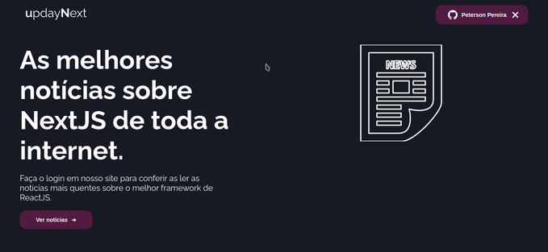

# updayNext

<p align="center">Esse projeto é uma revista digital feita com NextJS.</p>

<p align="center">
 <a href="#features">Features</a> •
 <a href="#pré-requisitos">Pré Requisitos</a> • 
 <a href="#🎲-rodando-o-front-end">Rodando a aplicação</a> • 
 <a href="#🛠-tecnologias">Tecnologias</a> •

</p>

---

<br>

<h1 align="center">
  
</h1>

### Features

- [x] Autenticação com Github via NextAuth.
- [x] É possivel adicionar o conteudo via CMS
- [x] O header da aplicação muda de acordo com o nome do usuário.
- [x] A aplicação consome a API do Prismic.

### Pré-requisitos

Antes de começar, você vai precisar ter instalado em sua máquina as seguintes ferramentas:
[Git](https://git-scm.com), [Node.js](https://nodejs.org/en/).
Além disto é bom ter um editor para trabalhar com o código como [VSCode](https://code.visualstudio.com/)

### 🎲 Rodando o Front End

```bash
# Clone este repositório
$ git clone https://github.com/pbpeterson/updayNextJs

# Acesse a pasta do projeto no terminal/cmd
$ cd updayNextJs

# Instale as dependências
$ yarn

# Execute a aplicação em modo de desenvolvimento
$ yarn dev

# O servidor iniciará na porta:3000 - acesse <http://localhost:3000>
```

### 🛠 Tecnologias

As seguintes ferramentas foram usadas na construção do projeto:

- [TypeScript](https://www.typescriptlang.org/)
- [Next](https://nextjs.org/)
- [Next Auth](https://next-auth.js.org/)
- [Sass](https://sass-lang.com/)
- [Prismic](https://prismic.io/)

---
